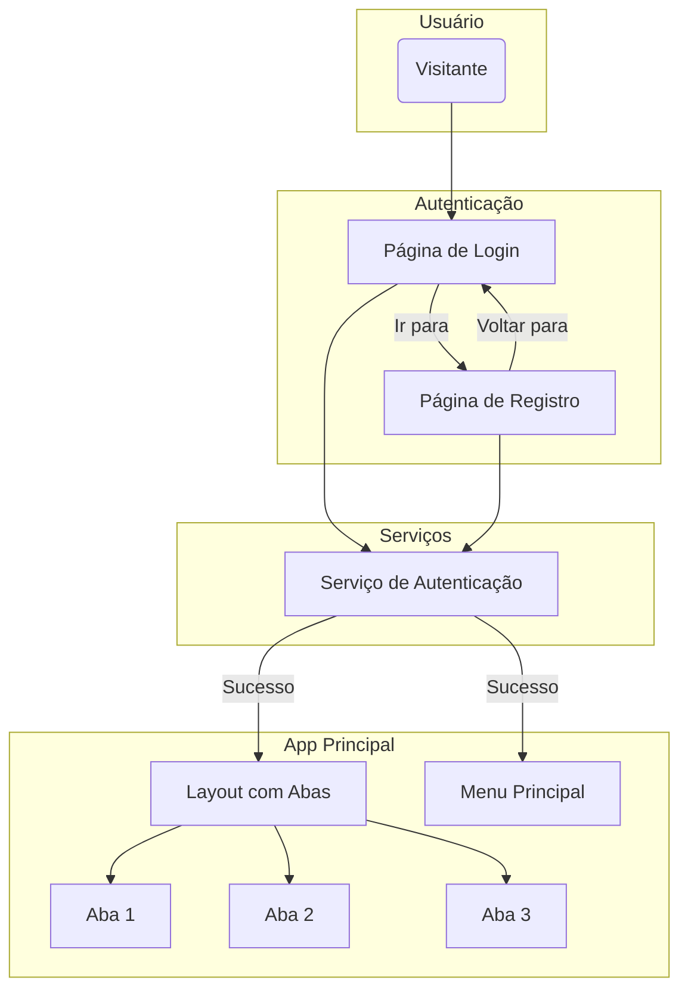

# Vida Plena App

**Vida Plena** é um aplicativo de bem-estar (Wellness) focado nos 8 Remédios Naturais, projetado para ajudar os usuários a cultivar um estilo de vida mais saudável e equilibrado.

Este é um projeto Ionic com Angular.

## Como Começar

Siga as instruções abaixo para configurar o ambiente de desenvolvimento e rodar o projeto localmente.

### Pré-requisitos

Você precisa ter o Node.js e o npm instalados na sua máquina. Também é recomendado ter o Angular CLI e o Ionic CLI instalados globalmente.

```bash
npm install -g @angular/cli
npm install -g @ionic/cli
```

### Instalação

1. Clone o repositório (ou use seu projeto local).
2. Navegue até o diretório do projeto.
3. Instale as dependências do `npm`:

```bash
npm install
```

### Rodando o Aplicativo

Para iniciar o servidor de desenvolvimento e abrir o aplicativo no seu navegador, use um dos seguintes comandos:

```bash
ionic serve
```
ou
```bash
npm start
```

## Scripts Disponíveis

No diretório do projeto, você pode executar:

- `npm start` ou `ionic serve`: Roda o app em modo de desenvolvimento.
- `npm run build`: Compila o aplicativo para produção.
- `npm test`: Executa os testes unitários via Karma.
- `npm run lint`: Executa o linter para analisar o código.

## Estrutura do Projeto

- `src/`: Contém todo o código-fonte da aplicação.
  - `src/app/`: Onde ficam os componentes, páginas e serviços do Angular.
  - `src/assets/`: Para arquivos estáticos como imagens e ícones.
  - `src/theme/`: Arquivos de estilização globais e variáveis de tema do Ionic.
- `capacitor.config.ts`: Configuração do Capacitor para builds nativos (iOS/Android).
- `ionic.config.json`: Configuração específica do projeto Ionic.

## Arquitetura

A aplicação segue uma arquitetura baseada em componentes, comum em projetos Angular. A estrutura é modular e organizada da seguinte forma:

- **Páginas (`src/app/pages`)**: Contém as páginas principais de um único nível, como `Login` e `Register`.
- **Navegação por Abas (`src/app/tabs`)**: O layout principal da aplicação após o login é controlado por um sistema de abas, onde cada aba (`tab1`, `tab2`, etc.) é sua própria página/componente.
- **Componentes (`src/app/components`)**: Componentes reutilizáveis, como cabeçalhos, rodapés ou cards, são colocados aqui para manter o código limpo e DRY (Don't Repeat Yourself). O `main-menu` é um exemplo.
- **Serviços (`src/app/services`)**: A lógica de negócio, como autenticação (`AuthService`) e chamadas de API, é isolada em serviços para ser injetada em qualquer componente ou página que precise dela.

### Diagrama de Fluxo

O diagrama abaixo ilustra o fluxo de navegação e a interação entre os principais módulos da aplicação.



---
*Este README foi gerado para ajudar na documentação do projeto.*
