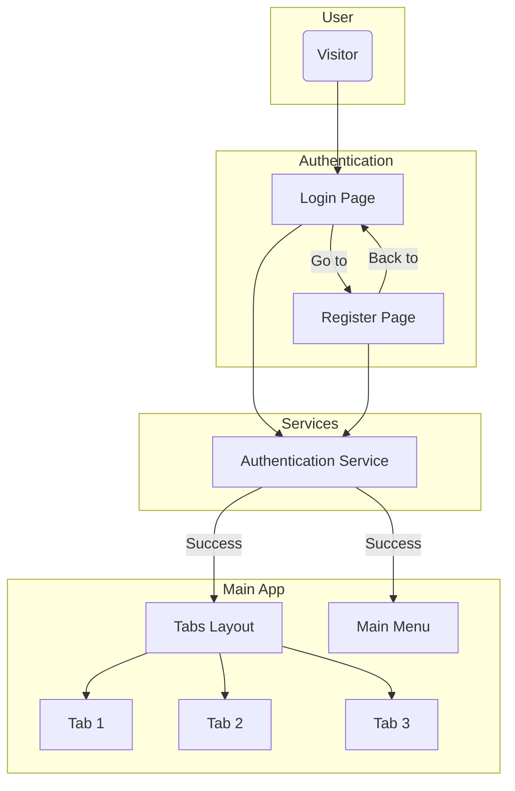

# Vida Plena App

**Vida Plena** is a wellness app focused on the 8 Natural Remedies, designed to help users cultivate a healthier and more balanced lifestyle.

This is an Ionic project with Angular.

## Getting Started

Follow the instructions below to set up the development environment and run the project locally.

### Prerequisites

You need to have Node.js and npm installed on your machine. It is also recommended to have Angular CLI and Ionic CLI installed globally.

```bash
npm install -g @angular/cli
npm install -g @ionic/cli
```

### Installation

1. Clone the repository (or use your local project).
2. Navigate to the project directory.
3. Install the npm dependencies:

```bash
npm install
```

### Running the Application

To start the development server and open the app in your browser, use one of the following commands:

```bash
ionic serve
```
or
```bash
npm start
```

## Available Scripts

In the project directory, you can run:

- `npm start` or `ionic serve`: Runs the app in development mode.
- `npm run build`: Builds the app for production.
- `npm test`: Runs unit tests via Karma.
- `npm run lint`: Runs the linter to analyze the code.

## Project Structure

- `src/`: Contains all the application source code.
  - `src/app/`: Where Angular components, pages, and services are located.
  - `src/assets/`: For static files such as images and icons.
  - `src/theme/`: Global styling files and Ionic theme variables.
- `capacitor.config.ts`: Capacitor configuration for native builds (iOS/Android).
- `ionic.config.json`: Project-specific Ionic configuration.

## Architecture

The application follows a component-based architecture, common in Angular projects. The structure is modular and organized as follows:

- **Pages (`src/app/pages`)**: Contains the main single-level pages, such as `Login` and `Register`.
- **Tab Navigation (`src/app/tabs`)**: The main layout of the app after login is controlled by a tab system, where each tab (`tab1`, `tab2`, etc.) is its own page/component.
- **Components (`src/app/components`)**: Reusable components, such as headers, footers, or cards, are placed here to keep the code clean and DRY (Don't Repeat Yourself). The `main-menu` is an example.
- **Services (`src/app/services`)**: Business logic, such as authentication (`AuthService`) and API calls, is isolated in services to be injected into any component or page that needs it.

### Flow Diagram

The diagram below illustrates the navigation flow and interaction between the main modules of the application.



---
*This README was generated to help document the project.* 